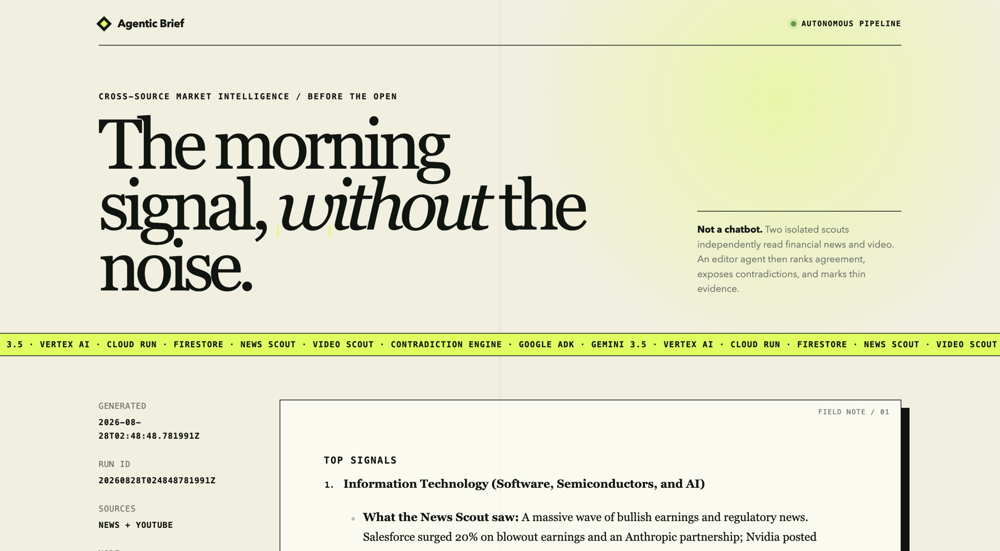
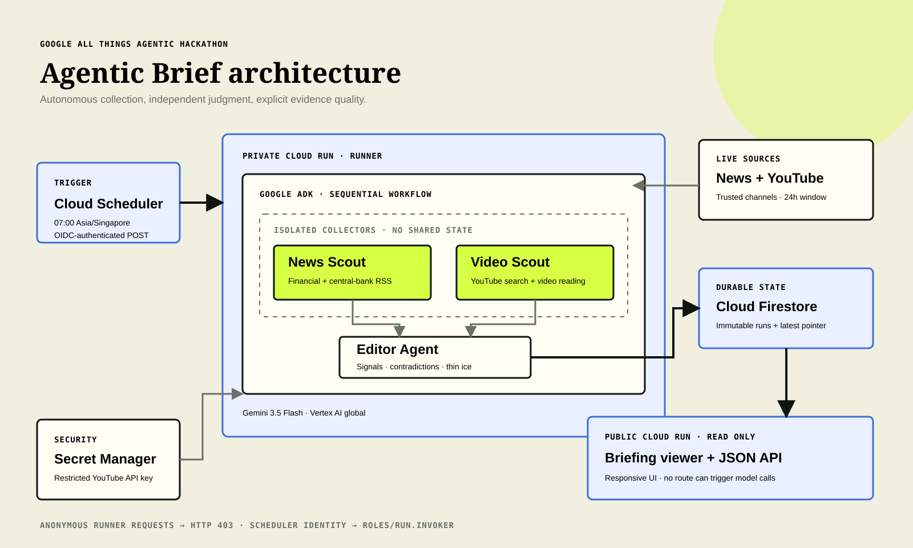

<p align="center"><b>English</b> | <a href="README_zh.md">简体中文</a></p>

<h1 align="center">Agentic Brief</h1>

<p align="center">
  <b>An autonomous morning market briefing that finds agreement, disagreement, and thin evidence.</b><br>
  Google ADK · Gemini 3.5 · Vertex AI · Cloud Run · Firestore · Cloud Scheduler
</p>

<p align="center">
  <a href="LICENSE"></a>
  
  
  
</p>

<p align="center">
  <a href="#live-demo">Live demo</a> ·
  <a href="#how-it-works">How it works</a> ·
  <a href="#architecture">Architecture</a> ·
  <a href="#run-locally">Run locally</a> ·
  <a href="#deploy-to-google-cloud">Deploy</a> ·
  <a href="CHANGELOG.md">Changelog</a>
</p>

---

## Live demo

**Public briefing:** [agentic-brief-web-qjv2kumm3q-as.a.run.app](https://agentic-brief-web-qjv2kumm3q-as.a.run.app/)

**Demo video:** [Watch the 3:45 walkthrough on YouTube](https://youtu.be/2GYxLUbTnRQ)



Agentic Brief is not a chat interface. Every morning at 07:00 Singapore time, Cloud Scheduler invokes a private Cloud Run service. Two isolated research agents independently read financial news and finance video. A third agent compares their reports, ranks sector signals, preserves contradictions, and explicitly labels claims supported by only one source. The result is stored in Firestore and published through a separate read-only Cloud Run service.

## Why this exists

Morning market research is repetitive but judgment-heavy: scan the news, watch current financial commentary, determine what actually changed, and resist turning a loud single source into a false consensus. A simple summarizer collapses those steps into one confident paragraph. Agentic Brief keeps the research paths independent and makes evidence quality part of the output.

The project was built for the Google All Things Agentic Hackathon around a real daily workflow, with autonomous action as the default rather than waiting for a user prompt.

## How it works

1. **News Scout** fetches recent CNBC, MarketWatch, and Federal Reserve RSS entries, removes duplicates, and extracts market-moving events.
2. **Video Scout** searches five trusted official finance channels through the YouTube Data API, selects one recent 4–20 minute video, and asks Gemini 3.5 to inspect the actual audio and visible content.
3. The scouts cannot see each other's state. This prevents one source from influencing how the other source is read.
4. **Editor Agent** receives both completed reports and produces four sections: `TOP SIGNALS`, `CONTRADICTIONS`, `THIN ICE`, and `WHAT CHANGED`.
5. The private runner writes the immutable run plus a latest-run pointer to Firestore. The public viewer can read results but cannot trigger model calls.

## Architecture



The public and private HTTP surfaces are deliberately separate. Cloud Run IAM rejects anonymous calls to the runner, while Cloud Scheduler receives a scoped OIDC identity with only `roles/run.invoker`. The YouTube key is mounted from Secret Manager and is never stored in the image or repository.

## Verified cloud run

- Private runner rejected an unauthenticated `POST /run` with HTTP 403.
- Authenticated Scheduler execution completed with HTTP 201 in 69.6 seconds.
- Firestore stored `news_findings`, `video_findings`, and a 4,000+ character `daily_brief` without stub URLs.
- Public `GET /` and `GET /api/latest` returned HTTP 200.
- Desktop and 390 px mobile browser assertions passed with no horizontal overflow.
- Test suite: 48 tests, 87% package coverage at the final cloud release.

## Run locally

### Prerequisites

- Python 3.12
- A Google Cloud project with billing and Vertex AI enabled
- Access to `gemini-3.5-flash` in the Vertex AI `global` location
- A YouTube Data API v3 key
- [`uv`](https://docs.astral.sh/uv/) or another Python environment manager

### Setup

```bash
git clone https://github.com/simonlin1212/agentic-brief.git
cd agentic-brief
uv sync --extra dev
cp .env.example .env
chmod 600 .env
```

Fill `.env` without committing it:

```dotenv
GOOGLE_GENAI_USE_VERTEXAI=TRUE
GOOGLE_CLOUD_PROJECT=your-project-id
GOOGLE_CLOUD_LOCATION=global
YOUTUBE_API_KEY=your-restricted-youtube-key
AGENTIC_BRIEF_DEEP_MODEL=gemini-3.5-flash
AGENTIC_BRIEF_LOOKBACK_HOURS=24
AGENTIC_BRIEF_FREE_TIER=0
```

Authenticate and run one complete cycle:

```bash
gcloud auth application-default login
.venv/bin/python run_local.py
```

The application fails fast if the location is not `global`, the lookback is outside 1–168 hours, or a configured Gemini model is older than 3.5.

## Deploy to Google Cloud

The production design uses two deployments of the same container: a private `runner` and a public read-only `web` service.

```bash
export PROJECT_ID="$(gcloud config get-value project)"
export REGION="asia-southeast1"

gcloud services enable \
  aiplatform.googleapis.com run.googleapis.com cloudbuild.googleapis.com \
  artifactregistry.googleapis.com firestore.googleapis.com \
  cloudscheduler.googleapis.com secretmanager.googleapis.com iam.googleapis.com

gcloud firestore databases create \
  --database='(default)' --location="$REGION" \
  --type=firestore-native --delete-protection

for account in agentic-brief-runner agentic-brief-web agentic-brief-scheduler; do
  gcloud iam service-accounts create "$account" --display-name="$account"
done

gcloud projects add-iam-policy-binding "$PROJECT_ID" \
  --member="serviceAccount:agentic-brief-runner@${PROJECT_ID}.iam.gserviceaccount.com" \
  --role=roles/aiplatform.user
gcloud projects add-iam-policy-binding "$PROJECT_ID" \
  --member="serviceAccount:agentic-brief-runner@${PROJECT_ID}.iam.gserviceaccount.com" \
  --role=roles/datastore.user
gcloud projects add-iam-policy-binding "$PROJECT_ID" \
  --member="serviceAccount:agentic-brief-web@${PROJECT_ID}.iam.gserviceaccount.com" \
  --role=roles/datastore.viewer
```

Create the secret without printing the key:

```bash
gcloud secrets create agentic-brief-youtube-key --replication-policy=automatic
.venv/bin/python -c \
  'from dotenv import dotenv_values; print(dotenv_values(".env")["YOUTUBE_API_KEY"], end="")' \
  | gcloud secrets versions add agentic-brief-youtube-key --data-file=-

gcloud secrets add-iam-policy-binding agentic-brief-youtube-key \
  --member="serviceAccount:agentic-brief-runner@${PROJECT_ID}.iam.gserviceaccount.com" \
  --role=roles/secretmanager.secretAccessor
```

Deploy the services, grant the Scheduler identity access to the private runner, and create the daily job:

```bash
gcloud run deploy agentic-brief-runner --source=. --region="$REGION" \
  --service-account="agentic-brief-runner@${PROJECT_ID}.iam.gserviceaccount.com" \
  --no-allow-unauthenticated --cpu=2 --memory=2Gi --concurrency=1 \
  --max-instances=1 --timeout=600 \
  --set-env-vars="AGENTIC_BRIEF_SERVICE_MODE=runner,GOOGLE_GENAI_USE_VERTEXAI=TRUE,GOOGLE_CLOUD_PROJECT=${PROJECT_ID},GOOGLE_CLOUD_LOCATION=global,AGENTIC_BRIEF_FREE_TIER=0" \
  --set-secrets="YOUTUBE_API_KEY=agentic-brief-youtube-key:1"

RUNNER_URL="$(gcloud run services describe agentic-brief-runner \
  --region="$REGION" --format='value(status.url)')"
IMAGE="$(gcloud run services describe agentic-brief-runner \
  --region="$REGION" --format='value(spec.template.spec.containers[0].image)')"

gcloud run deploy agentic-brief-web --image="$IMAGE" --region="$REGION" \
  --service-account="agentic-brief-web@${PROJECT_ID}.iam.gserviceaccount.com" \
  --allow-unauthenticated --memory=512Mi --max-instances=2 \
  --set-env-vars="AGENTIC_BRIEF_SERVICE_MODE=web,GOOGLE_CLOUD_PROJECT=${PROJECT_ID},GOOGLE_CLOUD_LOCATION=global"

gcloud run services add-iam-policy-binding agentic-brief-runner \
  --region="$REGION" \
  --member="serviceAccount:agentic-brief-scheduler@${PROJECT_ID}.iam.gserviceaccount.com" \
  --role=roles/run.invoker

gcloud scheduler jobs create http agentic-brief-daily \
  --location="$REGION" --schedule='0 7 * * *' --time-zone='Asia/Singapore' \
  --uri="${RUNNER_URL}/run" --http-method=POST \
  --oidc-service-account-email="agentic-brief-scheduler@${PROJECT_ID}.iam.gserviceaccount.com" \
  --oidc-token-audience="$RUNNER_URL" --attempt-deadline=600s \
  --min-backoff=900s --max-backoff=900s \
  --max-retry-attempts=3
```

## Test and review

```bash
uv sync --extra dev
.venv/bin/ruff check .
.venv/bin/pytest --cov=agentic_brief --cov-report=term-missing
```

The tests cover configuration gates, feed failure isolation, YouTube result validation, URL/SSRF boundaries, secret-safe API errors, Vertex video input order, ADK output capture, Firestore persistence, public/private route separation, XSS-safe Markdown rendering, and generic production error responses.

## Project structure

```text
src/agentic_brief/
├── agent.py          # ADK workflow: isolated scouts followed by editor
├── pipeline.py       # One unattended research cycle
├── service.py        # Public viewer or private runner HTTP surface
├── store.py          # Atomic Firestore writes and latest pointer
├── tools/sources.py  # RSS, YouTube Data API, and Vertex video analysis
└── templates/        # Responsive briefing viewer
```

## Limits

- The system uses two source families, not a comprehensive institutional data terminal. `THIN ICE` exists to keep that limitation visible.
- YouTube search is deliberately restricted to five official finance channels to reduce noise and avoid arbitrary creator claims.
- This project is research automation, not personalized investment advice or an execution system.

## Changelog

See [CHANGELOG.md](CHANGELOG.md).

## Disclaimer

Agentic Brief is an experimental research tool. Its output may be incomplete or wrong and must not be treated as financial advice, a recommendation, or an instruction to transact.

## Support

If this project helped, a coffee supports continued open-source work.

<p align="center">
  <a href="https://buymeacoffee.com/simonlin1212"></a>
</p>

## License

MIT. See [LICENSE](LICENSE).

**Author:** Simon Lin · X [@linsizhen](https://x.com/linsizhen) · Email: [simonlin0423@gmail.com](mailto:simonlin0423@gmail.com)
